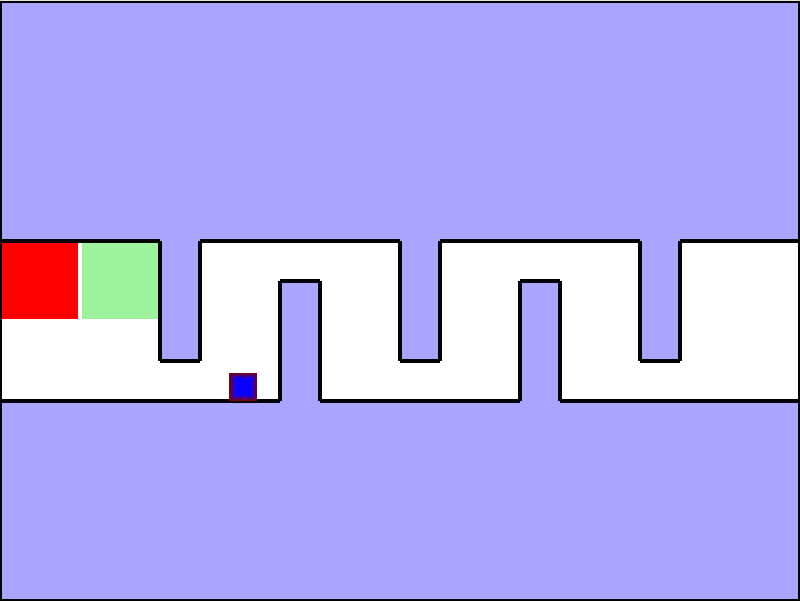

# Adversarial Reinforcement Learning

Melik Buğra Özçelik
Date: -

---

## Overview

- Introduction to Adversarial RL
- Key Concepts
- Related Work
- Proposed Idea/Method
- First Results

---

## Introduction

- What is Adversarial Reinforcement Learning?
- Adversary Types:
    1. Internal
    2. External

---

<style>
img[alt~="top-right"] {
  position: absolute;
  top: 120px;
  right: 30px;
}
</style>

## Key Concepts

- Continuous Maze (Toy Problem)
- Adversarial SAC
- Adversary Rewarding
- Reward Scaling by Protagonist Entropy
- Stirring (Target Problem)

<!-- Image showing continuous maze environment -->


---

## Related Work

<!-- Put a link here  -->
- [Robust Adversarial Reinforcement Learning](https://www.notion.so/Robust-Adversarial-Reinforcement-Learning-15d60a9d769380429425e3ba15268804)
- [Deep Adversarial Reinforcement Learning for Object Disentangling](https://www.notion.so/Deep-Adversarial-Reinforcement-Learning-for-Object-Disentangling-14e60a9d76938030886ce9291fe70400)
- [Adversarial Reinforcement Learning for Procedural Content Generation](https://www.notion.so/Adversarial-Reinforcement-Learning-for-Procedural-Content-Generation-14e60a9d769380069203e486aabe59a2)
- [Robust Reinforcement Learning using Adversarial Populations](https://www.notion.so/Robust-Reinforcement-Learning-using-Adversarial-Populations-14e60a9d76938064a89be0bf9eaf20e5)
- [Deep Adversarial Reinforcement Learning With Noise Compensation by Autoencoder](https://www.notion.so/Deep-Adversarial-Reinforcement-Learning-With-Noise-Compensation-by-Autoencoder-14f60a9d769380b785dcfb91092140db)
- [Adversarial Skill Learning for Robust Manipulation](https://www.notion.so/Adversarial-Skill-Learning-for-Robust-Manipulation-15d60a9d76938052bda7e16338cfd4db)
- [(Entropy Usage)Explore and Control with Adversarial Surprise](https://www.notion.so/Explore-and-Control-with-Adversarial-Surprise-1c460a9d76938069bcb6d1c95e34ba3e)
---

## Main Training Algorithm
$$
\begin{aligned}
& \text{// Main training loop} \\
& \text{for } i = 1 \text{ to } N: \\
& \quad \text{// Train adversary} \\
& \quad \text{for } j = 1 \text{ to } K_a: \\
& \quad \quad \text{Let adversary act for $H_a$ steps and train}  \\
& \quad \quad \text{Let protagonist act (greedy policy) for $H_p$ steps} \\
\\
& \quad \text{// Train protagonist} \\
& \quad \text{for } j = 1 \text{ to } K_p: \\
& \quad \quad \text{Let adversary act (greedy policy) for $H_a$ steps} \\
& \quad \quad \text{Let protagonist act for $H_p$ steps and train}
\end{aligned}
$$

- where an episode truncates at ($H_a + H_p$)th step.
- N is increased by 50 for every 10 iterations
---

## Rewarding by Value from Protagonist

- Reward for each step is the value of that step from protagonist
$$
r_{\text{adv}}(s_t, s_{t+1}) = V_{\text{prt}}(s_{t+1})
$$

- Unstable training of adversary until the critic network of protanist is trained enough to make reasonable estimations
- Pre-training of protagonist improves the performance

---

## Lazy Rewarding by Protagonist Return

- Reward of the last transition is the return of the protagonist
- All the other transtions' rewards are 0
$$
r_{\text{adv}}(s_t, s_{t+1}) = 
\begin{cases} 
G_{\text{prt}} & \text{if } t = H_a-1 \\
0 & \text{otherwise}
\end{cases}
$$

- Sparse rewarding of adversary caused unstabilities

---

## Lazy Dense Rewarding by Protagonist Return

- Reward of each transition is the equal share from return of the protagonist, that return is divided by total time steps played by protagonist
$$
r_{\text{adv}}(s_t, s_{t+1}) = \frac{G_{\text{prt}}}{T_{\text{prt}}}
$$

- Usually gets stuck at local maximas

---

## Rewarding Scaling by Entropy

- At each time step, the reward of adversary is scaled by the entropy value of the protagonist, taking N examples

$$
\begin{aligned}
\bar{V} &= \frac{1}{N} \sum_{i=1}^{N} V_i \\
\bar{H} &= \frac{1}{N} \sum_{i=1}^{N} H_i \\
H_{factor} &= \text{clamp}(\bar{H}, 0.1, 5.0) \\
r_{adv} &= -\frac{\bar{V}}{\beta \cdot H_{factor}}
\end{aligned}
$$

- Where $\bar{V}$ is the mean estimated value, $\bar{H}$ is the mean entropy, $\beta$ is the entropy scaling coefficient
- Higher entropy (more uncertainty) reduces the impact of negative value, encouraging exploration

---

## Using the Change of the Value as a Reward

- Reward of each transition it the value change between the steps of the transition

$$
\begin{aligned}
v_{prev}, \_ &= \text{estimate\_v\_and\_entropy}(s_{prev}) \\
v_{curr}, entropy &= \text{estimate\_v\_and\_entropy}(s_{curr}) \\
\Delta v &= (v_{prev} - v_{curr}) \\
H_{factor} &= \text{clamp}(\bar{H}, 0.1, 5.0) \\
scale &= \frac{\beta}{\beta + H_{factor}} \\
r_{adv} &= \Delta v \cdot scale
\end{aligned}
$$

---

<!-- Code sample with syntax highlighting -->
```python
def get_adversary_reward(
    prev_state: np.ndarray,
    state: np.ndarray,
    protagonist: SAC,
    num_samples: int = 10,
    beta: float = 1.0,
):
    ### REST OF THE CODE
    s_prev = torch.tensor(prev_state, dtype=torch.float32, device=device).unsqueeze(0)
    s_curr = torch.tensor(state, dtype=torch.float32, device=device).unsqueeze(0)

    v_prev, _ = estimate_v_and_entropy(s_prev)
    v_curr, entropy = estimate_v_and_entropy(s_curr)

    # ΔV = V(s_prev) − V(s_curr)
    delta_v = (v_prev - v_curr).squeeze(0)

    entropy_factor = torch.clamp(entropy, min=0.1, max=5.0).squeeze(0)
    scale = beta / (beta + entropy_factor)

    scaled_reward = (delta_v * scale).cpu().item()
    return scaled_reward

```

---

<!-- Split content -->
<div class="columns">
<div>

## Current Progress

- We have our own SAC (in the [rl-baselines](https://github.com/melikbugra?tab=repositories) library) implementation
- We have our own environment [ContinuousMaze-v0](https://github.com/melikbugra/continuous-maze-env)
- We have a couple of methods proposed
- Reward scaling by entropy and using the value change as reward seems to be novel to the literature

</div>
<div>

## Next Steps

- Applying one (or some) of the methods to the robot stirring problem
- Finalizing the literature review
- Depending on the novelty of the idea, choosing and appropriate conference
- Final trainings and preparing the paper

</div>
</div>

---

# Thank You!

Questions?

